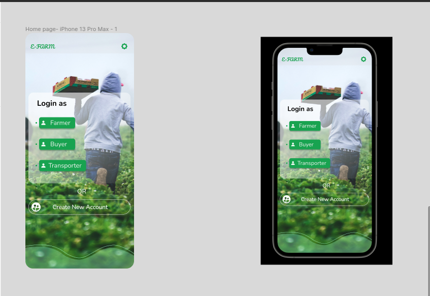

# Agritech
### Important GitHub commands
#### 1. git add.
#### 2. git commit -m "message"
  ##### 2.1 git branch - to show the current branch
  ##### 2.2 git checkout -b <new-branch> - to create a new branch
#### 3. git push --set-upstream origin <new-branch> - Note. You only do this when pushing the first time
  ###### For  the other push - git push <new-branch>

### Project Purpose
The proposed solution is a platform to help farmers document all of their farming activities as a way of digitizing and improving Quality Control. As the system will help farmers document all their agricultural processes for verification and traceability, buyers can verify the quality of these products using the system and therefore buy the products. The major benefit of using technology to track a product’s life history is that it improves the quality and credibility of produce. When a product is backed by traceability and whose quality is verifiable, farmers can negotiate pricing for their goods with a lot of confidence. By digitizing and treating Quality Control as a process rather than a single step, farmers can, after harvest, sell their products for better prices as the quality of their products is verifiable. The platform will also help farmers access transportation services by connecting them to available transporters alongside potential buyers.

## WORK IN PROGRESS 🖥️ 🪖 🚀
